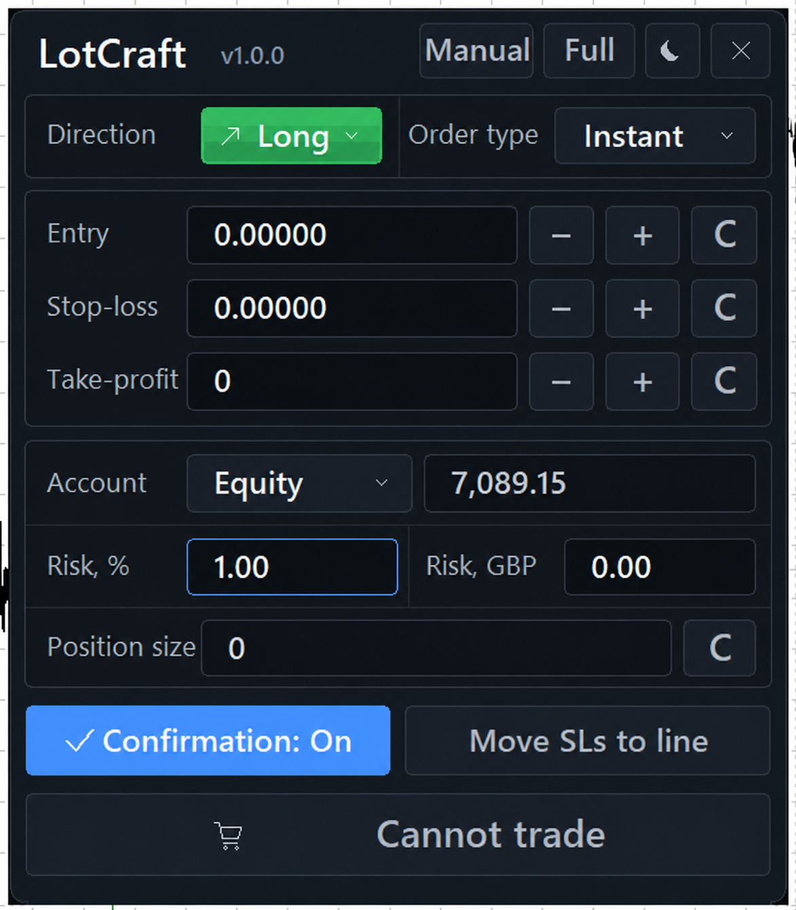
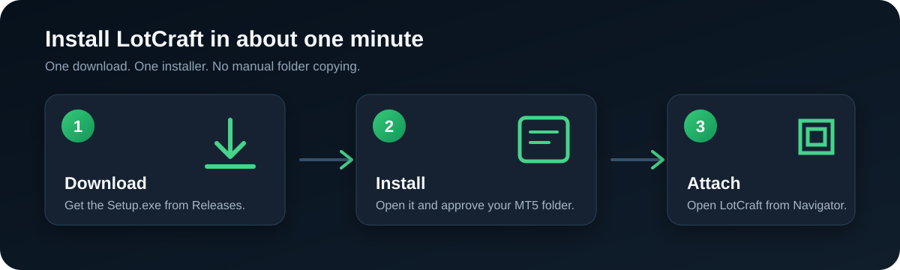

# LotCraft

<p align="center">
  <strong>Precise risk-based position sizing and deliberate order entry for MetaTrader 5.</strong>
</p>

<p align="center">
  
  
  
  <a href="https://github.com/saroo98/LotCraft/releases/latest"></a>
</p>

<p align="center">
  
</p>

LotCraft calculates a tradable position size from your chosen account basis, risk percentage, entry price and stop-loss. It gives you draggable chart levels, Full, Compact and Mini layouts, dark and light themes, pending or market entry, confirmation control, and an explicit final trade button.

It does **not** generate signals or place autonomous trades. A new order begins only when you press the final Buy or Sell button.

## Install

<p align="center">
  
</p>

### 1. Download

Open the [latest GitHub Release](https://github.com/saroo98/LotCraft/releases/latest) and download:

`LotCraft-1.0.0-Setup.exe`

The installer is self-contained. You do not need to download or copy a separate `.ex5` file.

### 2. Run the installer

1. Close MetaTrader 5, or leave it open and refresh Navigator after installation.
2. Double-click `LotCraft-1.0.0-Setup.exe`.
3. Approve the MT5 terminal data directory detected by the installer.
4. Wait for the success message.

If Windows SmartScreen appears because the community build is not code-signed, select **More info**, verify that the filename is `LotCraft-1.0.0-Setup.exe`, and then choose **Run anyway** only if you downloaded it from this repository.

### 3. Attach LotCraft

1. Open MetaTrader 5.
2. In **Navigator**, right-click **Expert Advisors** and choose **Refresh**.
3. Expand **Expert Advisors → LotCraft**.
4. Drag **LotCraft** onto a chart.
5. Enable **Allow DLL imports** when prompted. LotCraft uses Windows integration for clipboard feedback, native pointer-release handling and the MT5 order-dialog shortcut.
6. Make sure MT5 **Algo Trading** is enabled before submitting an order.

LotCraft is now ready. Start on a demo account until you are comfortable with your broker’s symbol specifications and order rules.

## What you can do

- Calculate position size from Equity, Balance or Free Margin.
- Set risk as a percentage and see the corresponding account-currency risk.
- Use Instant or Pending entry.
- Drag visible Entry and SL markers directly on the chart.
- Automatically align Long or Short direction from the SL position.
- Set an optional TP.
- Hold the plus/minus controls for exponentially accelerating price adjustment.
- Edit individual digits with normal Windows-style caret and selection behavior.
- Move all eligible stop losses for the current chart symbol to the LotCraft SL line.
- Switch between Full, Compact and Mini modes.
- Use dark or light themes.
- Require an additional confirmation step before execution.

## Safety model

LotCraft is intentionally conservative:

- It never produces trading signals.
- It never submits a new order without an explicit press of the final trade control.
- It validates broker volume, price, stop-distance and filling constraints.
- It blocks ambiguous netting-account aggregation scenarios.
- It scopes chart objects, persistent state and installer ownership to LotCraft.
- The uninstaller removes only files listed in its verified installation manifest.

Trading involves substantial risk. Position sizing reduces avoidable sizing mistakes, but it cannot eliminate slippage, gaps, execution failure or market loss.

## Uninstall

Run:

`MQL5\Experts\LotCraft\LotCraft-Uninstall.exe`

The uninstaller verifies its manifest and removes only LotCraft-owned files. Any unrelated files in the directory are preserved.

## Build from source

Requirements:

- Windows x64
- MetaTrader 5 with MetaEditor
- Go 1.23 or newer
- Python 3.11 or newer

Run the automated tests:

```powershell
py -3.11 -m pytest -q
```

Build, verify and optionally install a release:

```powershell
.\scripts\build_release.ps1 `
  -MetaEditorPath "C:\Program Files\MetaTrader 5\MetaEditor64.exe"
```

For the complete reproducible workflow, see [Build and installation](docs/BUILD_AND_INSTALL.md), [Architecture](docs/ARCHITECTURE.md), and [Test plan](docs/TEST_PLAN.md).

## Privacy

The public repository excludes local build output, terminal identifiers, installation logs, generated verification evidence, caches, credentials and environment files. LotCraft does not require an online account or cloud service to perform its position-sizing calculations.
